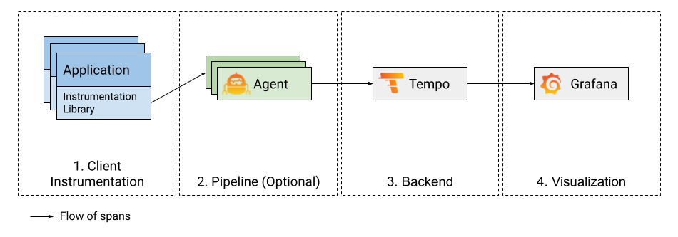

# midwayjs-otel-demo

`doocker-compose up`

- order service port: 7071
- user service port: 7072
- product service port: 7073

中间件
- otel/opentelemetry-collector-contrib
- tempo
  - 支持本地存储，在只有一个节点的情况下，可以不需要对象存储
- grafana 展示
- metric： otel 收集 + mimir 存储 代替prometheus

资料
- https://opentelemetry.io/docs/languages/js/
- https://github.com/grafana/intro-to-mltp
- https://grafana.com/docs/tempo/latest/getting-started/
- tempo 参数 https://blog.frognew.com/2023/06/tempo-04-enable-multitenancy-and-block-retention.html

todo
- [ ] trace 和 metric 关联
- [ ] trace 和 日志 关联
  - [ ] 从trace跳到log
  - [x] 从log跳到trace
  
- [ ] cpu相关，[pyroscope](https://grafana.com/docs/pyroscope/latest/introduction/)
- [ ] [Beyla](https://github.com/grafana/beyla)
